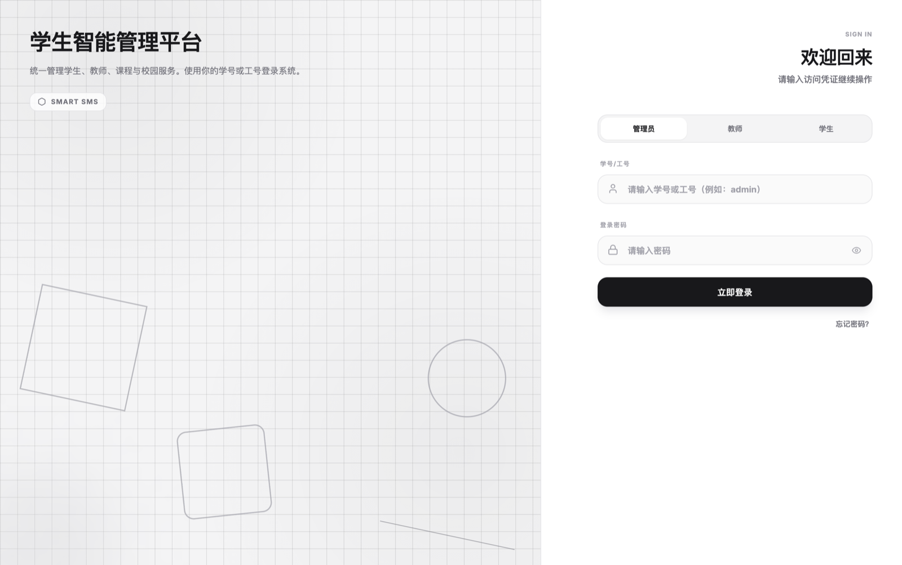
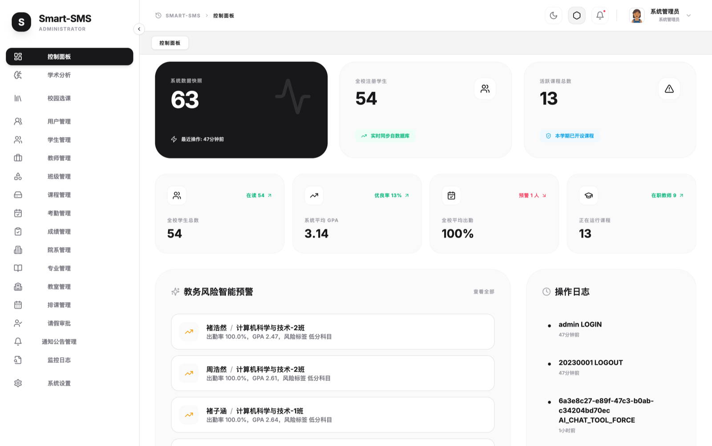
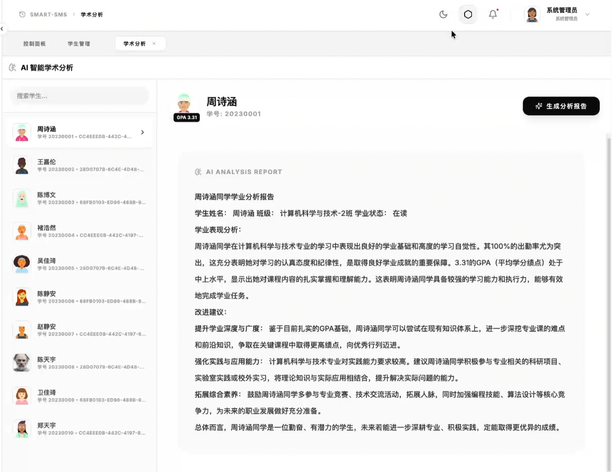
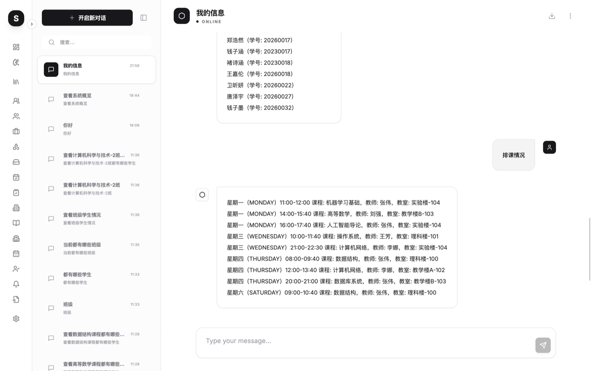
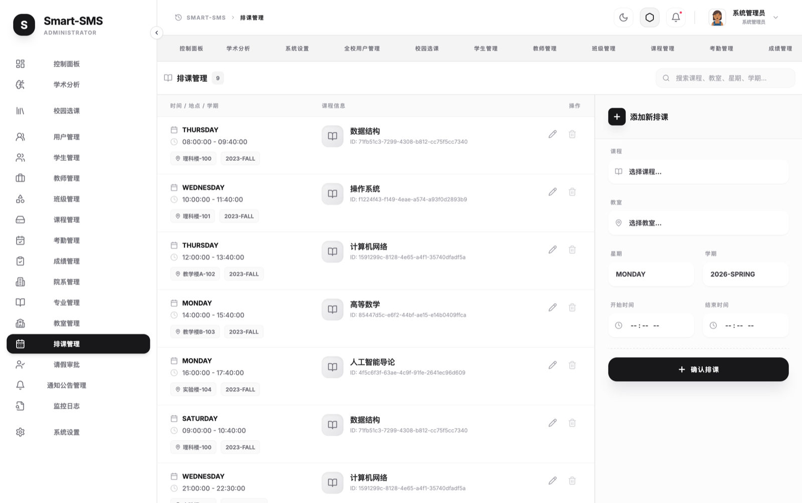
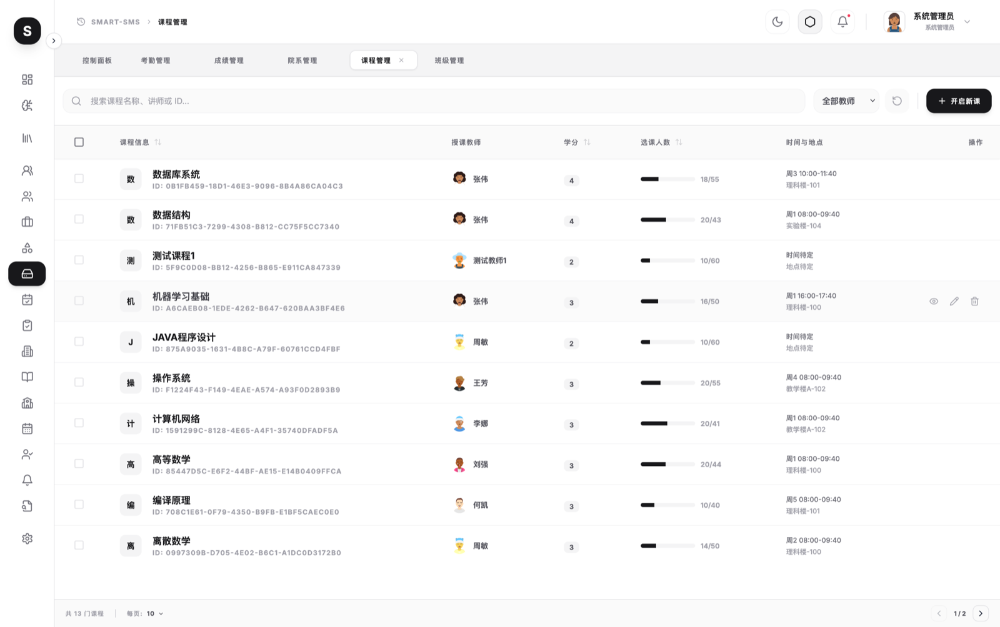
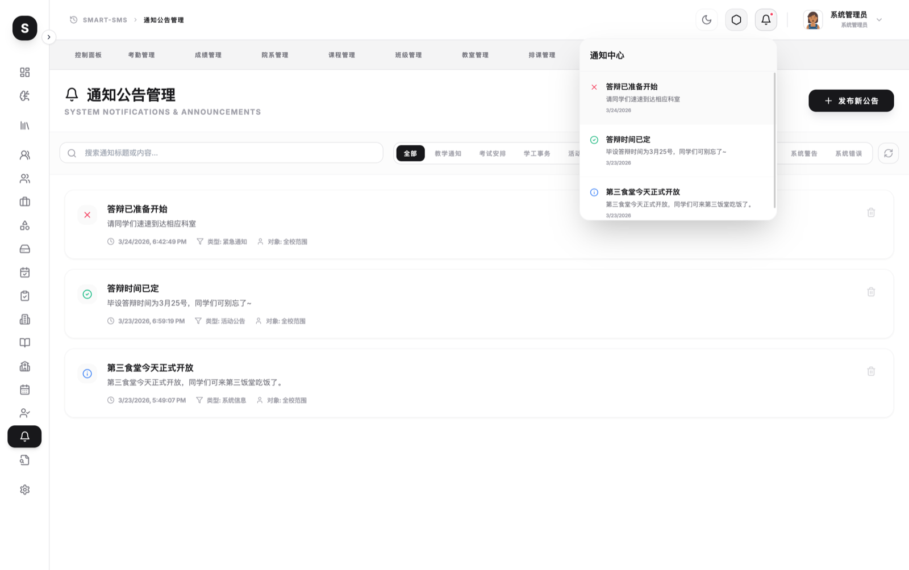
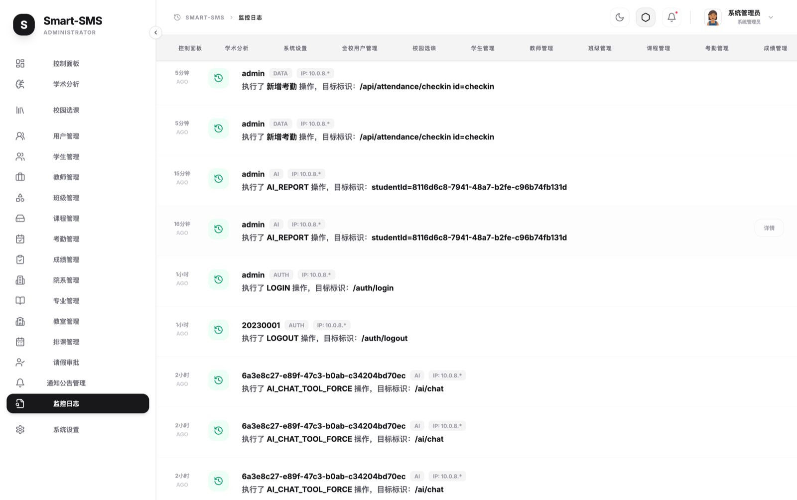

# Smart SMS AI

Smart SMS AI 是一个基于 Spring Boot 和 React 的学生智能管理系统。它覆盖学生、教师、课程、班级、教室、考勤、排课、成绩、通知和活动日志等常见校园管理场景，并通过后端统一代理通用 AI 服务，用于智能问答和学生表现分析。

本项目适合学习全栈开发、课程设计、毕业设计原型、管理系统演示和二次开发。仓库默认不包含真实密钥，AI 能力需要由部署者在服务端自行配置。

## 功能特性

- 多角色登录与权限控制：管理员、教师、学生。
- 学生管理：列表、搜索、筛选、详情、批量操作和状态管理。
- 教师、班级、课程、教室、院系和专业等基础数据管理。
- 课程服务：选课、退课、课程排期和学生视角课程信息。
- 教学事务：考勤、成绩、作业、请假审批、通知管理。
- 数据看板：核心指标、趋势图表和运营概览。
- AI 助手：后端代理远程或本地 OpenAI-compatible 服务，前端不接触 API key。
- 审计与活动日志：记录关键操作，便于演示和排查。
- Swagger/OpenAPI 文档、Docker 配置和 GitHub Actions CI。

## 技术栈

| 层级      | 技术                                                         |
| --------- | ------------------------------------------------------------ |
| 后端      | Java 21, Spring Boot 3.2.1, Spring Security, Spring Data JPA |
| 数据库    | PostgreSQL 16, H2 for tests                                  |
| 认证      | JWT, HTTP-only Cookie                                        |
| API 文档  | SpringDoc OpenAPI, Swagger UI                                |
| 前端      | React 19, TypeScript, Vite                                   |
| UI        | Tailwind CSS, Lucide React, Recharts, Framer Motion          |
| 测试与 CI | Maven, Vitest, GitHub Actions                                |
| 部署      | Docker, Docker Compose                                       |

## 界面预览

以下截图展示了项目的核心界面，均使用演示账号登录后截取。

| 登录页                                 | 数据看板                                   |
| -------------------------------------- | ------------------------------------------ |
|  |  |

| AI分析                                 | AI对话                                 |
| -------------------------------------- | -------------------------------------- |
|  |  |

| 排课管理                                   | 课程管理                                   |
| ------------------------------------------ | ------------------------------------------ |
|  |  |

| 通知公告                                   | 操作日志                                   |
| ------------------------------------------ | ------------------------------------------ |
|  |  |

## 项目结构

```text
smart-sms-ai/
├── backend/                  # Spring Boot 后端
│   ├── src/main/java/com/smartsms/
│   │   ├── ai/               # AI 代理、配置和会话
│   │   ├── security/         # 登录认证与 JWT
│   │   ├── student/          # 学生管理
│   │   ├── teacher/          # 教师管理
│   │   ├── course/           # 课程管理
│   │   ├── classroom/        # 教室管理
│   │   ├── attendance/       # 考勤
│   │   ├── schedule/         # 排课
│   │   ├── assignment/       # 作业
│   │   ├── department/       # 院系
│   │   ├── major/            # 专业
│   │   ├── activity/         # 活动日志
│   │   └── common/           # 通用配置、异常和基础设施
│   └── docker/               # Dockerfile 与 Compose 配置
├── frontend/                 # React 前端
│   ├── components/           # 页面和组件
│   ├── contexts/             # 前端状态上下文
│   ├── services/             # API 调用封装
│   └── types.ts              # 前端类型定义
├── CONTRIBUTING.md
├── SECURITY.md
└── LICENSE
```

## 环境要求

- Java 21
- Node.js 18 或更高版本，CI 使用 Node.js 20
- Docker Desktop 或兼容的 Docker Compose 环境
- PostgreSQL 16，本地开发可直接使用仓库内的 Compose 配置启动

## 快速开始

### 1. 启动本地数据库

```bash
cd backend/docker
docker compose -f docker-compose.dev.yml up -d
```

开发数据库默认连接信息：

| 项目     | 值          |
| -------- | ----------- |
| Host     | `localhost` |
| Port     | `5432`      |
| Database | `smart_sms` |
| Username | `postgres`  |
| Password | `postgres`  |

### 2. 启动后端

```bash
cd backend
./mvnw spring-boot:run -Dspring-boot.run.profiles=dev
```

后端默认地址：

- API: `http://localhost:8080/api`
- Swagger UI: `http://localhost:8080/api/swagger-ui/index.html`
- Health: `http://localhost:8080/api/actuator/health`

### 3. 启动前端

```bash
cd frontend
npm ci
npm run dev
```

前端默认地址为 `http://localhost:3000`，Vite 会把 `/api` 请求代理到 `http://localhost:8080`。

## 测试账号

开发环境启动后可使用以下演示账号登录：

| 角色   | 用户名     | 密码     |
| ------ | ---------- | -------- |
| 管理员 | `admin`    | `123456` |
| 教师   | `T2024001` | `123456` |
| 学生   | `20230001` | `123456` |

这些账号仅用于本地演示。生产环境请重新初始化用户、修改默认密码，并设置强随机 `JWT_SECRET`。

## AI 配置

AI 调用全部由后端代理处理。前端不会读取、保存或打包 `AI_API_KEY`。

远程 AI 默认使用 OpenAI-compatible 的聊天接口格式。只体验基础管理功能时，可以不配置 AI 相关变量；调用 AI 功能时，未配置的服务会返回明确提示。

### 远程 AI

```bash
export AI_PROVIDER=remote
export AI_API_KEY=your-ai-api-key
export AI_BASE_URL=https://api.example.com
export AI_MODEL=your-model-name
export AI_CHAT_PATH=/v1/chat/completions
```

### 本地 AI

```bash
export AI_PROVIDER=local
export OLLAMA_BASE_URL=http://localhost:8000
export OLLAMA_MODEL=qwen/qwen3-1.7b
```

### AI 环境变量

| 变量                     | 说明                                                    | 默认值                  |
| ------------------------ | ------------------------------------------------------- | ----------------------- |
| `AI_PROVIDER`            | AI 提供方，支持 `remote`、`local`，并兼容 `ollama` 别名 | `remote`                |
| `AI_API_KEY`             | 远程 AI API key                                         | 空                      |
| `AI_BASE_URL`            | 远程 OpenAI-compatible API 基础地址                     | 空                      |
| `AI_MODEL`               | 远程模型名称                                            | 空                      |
| `AI_TIMEOUT`             | 远程 AI 请求超时时间，单位毫秒                          | `120000`                |
| `AI_CHAT_PATH`           | 远程聊天接口路径                                        | `/v1/chat/completions`  |
| `OLLAMA_BASE_URL`        | 本地 OpenAI-compatible 服务地址                         | `http://localhost:8000` |
| `OLLAMA_MODEL`           | 本地模型名称                                            | `qwen/qwen3-1.7b`       |
| `OLLAMA_API_KEY`         | 本地服务 API key，可为空                                | 空                      |
| `OLLAMA_CHAT_PATH`       | 本地聊天接口路径                                        | `/v1/chat/completions`  |
| `OLLAMA_COMPLETION_PATH` | 本地补全接口路径                                        | `/v1/completions`       |

## 常用脚本

后端：

```bash
cd backend
./mvnw test
./mvnw spring-boot:run -Dspring-boot.run.profiles=dev
```

前端：

```bash
cd frontend
npm ci
npm run dev
npm run build
npm test -- --run
```

## API 文档

本地启动后访问 Swagger UI：

```text
http://localhost:8080/api/swagger-ui/index.html
```

主要 API 模块：

| 模块        | 路径                     | 说明                 |
| ----------- | ------------------------ | -------------------- |
| Auth        | `/api/auth/*`            | 登录、登出、认证状态 |
| Users       | `/api/users/*`           | 用户管理             |
| Students    | `/api/students/*`        | 学生管理             |
| Teachers    | `/api/teachers/*`        | 教师管理             |
| Classes     | `/api/classes/*`         | 班级管理             |
| Courses     | `/api/courses/*`         | 课程管理和选课       |
| Classrooms  | `/api/classrooms/*`      | 教室管理             |
| Departments | `/api/departments/*`     | 院系管理             |
| Majors      | `/api/majors/*`          | 专业管理             |
| Attendance  | `/api/attendance/*`      | 考勤                 |
| Schedules   | `/api/schedules/*`       | 排课                 |
| Activities  | `/api/activities/*`      | 活动日志             |
| AI          | `/api/ai/*`              | AI 聊天、报告和会话  |
| AI Config   | `/api/admin/ai-config/*` | 管理员 AI 配置       |

## 生产部署

生产 Compose 文件位于 `backend/docker/docker-compose.yml`。首次部署前创建 `.env`：

```bash
cd backend/docker
cp .env.example .env
```

至少修改以下变量：

```env
POSTGRES_PASSWORD=change-me
JWT_SECRET=change-this-to-a-random-string-with-at-least-32-characters
AI_API_KEY=
AI_BASE_URL=
AI_MODEL=
```

启动服务：

```bash
docker compose up -d --build
```

生产部署建议：

- 使用强随机 `JWT_SECRET`，长度至少 32 个字符。
- 修改数据库密码和所有默认演示账号密码。
- 不要把 `.env`、数据库导出、日志文件和真实密钥提交到仓库。
- 为后端配置 HTTPS 反向代理和受控的 CORS 来源。
- AI key 只放在服务端环境变量或受控密钥管理系统中。

## 测试

```bash
cd frontend
npm ci
npm run build
npm test -- --run

cd ../backend
./mvnw test
```

CI 会在 push 到 `main`、`master` 和 Pull Request 时运行后端测试、前端构建和前端测试。

## 开源发布清单

发布到 GitHub 前建议逐项确认：

- 没有提交真实 API key、JWT secret、数据库密码、日志或 `.env` 文件。
- 如果密钥曾经进入旧仓库历史，先轮换密钥，再清理历史或使用干净仓库发布。
- `README.md`、`CONTRIBUTING.md`、`SECURITY.md` 和 `LICENSE` 已保留在仓库根目录。
- 本地执行过 `npm run build`、`npm test -- --run` 和 `./mvnw test`。
- 生产环境不要继续使用演示账号和默认密码。
- issue、PR、release 和分支保护规则按项目需要配置。

## 贡献

欢迎提交 issue、文档改进、bug 修复和功能增强。开始贡献前请阅读 `CONTRIBUTING.md`。如果发现安全问题，请按 `SECURITY.md` 中的方式处理，不要直接公开披露漏洞细节。

## 许可证

本项目基于 MIT License 开源，详见 `LICENSE`。
